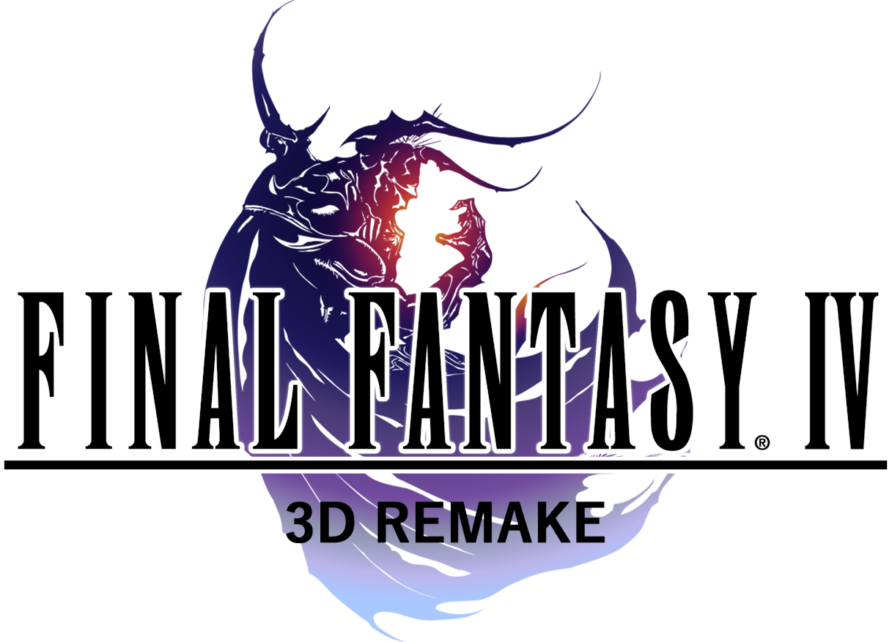

<h1 align=center>Final Fantasy IV: The After Years — Nintendo Switch port</h1>

This is a wrapper/port of the Android version of *Final Fantasy IV: The After Years*
(`com.square_enix.android_googleplay.FF4AY_GP`, v1.0.13). It loads the original game
binary, patches it and runs it: we natively run the original Android `.so` inside a
minimal emulated Android environment

### How to install

You're going to need:
* The **`.apk`** for version 1.0.13. All the game data lives in `assets/main.obb` inside
  the APK; the engine code is `lib/arm64-v8a/libff4a.so`.

To install:
1. Create a folder called `ff4tay` in the `switch` folder on your SD card.
2. From your `.apk`, extract **`lib/arm64-v8a/libff4a.so`** to `/switch/ff4tay/`.
3. From your `.apk`, extract **`assets/main.obb`** to `/switch/ff4tay/`.
4. Copy **`ff4tay_nx.nro`** into `/switch/ff4tay/`.

So `/switch/ff4tay/` should contain: `libff4a.so`, `main.obb`, `ff4tay_nx.nro`.

### Notes

This will not work in applet/album mode. Use a game override (hold R on a title) or a
forwarder, so the homebrew gets the full memory and required syscalls.

Save games (`save.bin`), achievement data and the port's `config.txt` are stored in
`/switch/ff4tay/`.

### Configuration

`config.txt` is created on first run:
* `screen_width` / `screen_height` — render resolution; `-1` picks 1280x720 handheld and
  1920x1080 docked.
* `widescreen` — set to `1` for a 16:9 viewport, or `0` for the legacy aspect.
* `language` — selects the localized text and assets:
  `0` ru, `1` th, `2` ja, `3` en, `4` fr, `5` de, `6` it, `7` es, `8` zh_CN, `9` zh_TW,
  `10` ko, `11` pt. Defaults to English.

### How to build

You're going to need devkitA64 and the following devkitPro packages:
* `switch-mesa`
* `switch-libdrm_nouveau`
* `switch-sdl2`
* `switch-freetype`
* `switch-libpng`
* `switch-harfbuzz`

### Credits

* fgsfds for [max_nx](https://github.com/fgsfdsfgs/max_nx), which this loader is based on
* TheOfficialFloW for the original Vita ports that pioneered this technique

### Support

If you enjoy my work and want to support me :

### Legal

This project has no direct affiliation with Square Enix. "Final Fantasy" and "Final
Fantasy IV: The After Years" are trademarks of their respective owners. All Rights
Reserved.

No assets or program code from the original game or its Android port are included in this
project. We do not condone piracy in any way, shape or form and encourage users to
legally own the original game.

Unless specified otherwise, the source code provided in this repository is licensed under
the MIT License. Please see the accompanying LICENSE file.
